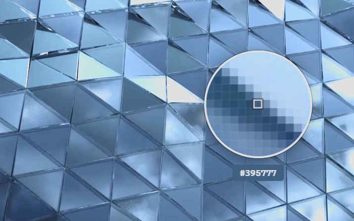

# electron-pixel-picker

> 零依赖的 Electron 屏幕取色器。全屏覆盖层 + 像素网格放大镜 + 滚轮缩放 + Hex 颜色输出。



## 特性

- **支持采集屏幕任意位置的颜色** -- 不局限于 Electron 窗口内。截取整个桌面，用户可以从任何应用、壁纸或系统 UI 取色。解决了 [EyeDropper API 的局限](https://developer.mozilla.org/en-US/docs/Web/API/EyeDropper_API)——点击 Electron 窗口外会导致取色被取消的问题
- **零依赖** -- 仅使用 Electron 内置 API（desktopCapturer、BrowserWindow）
- **像素网格放大镜** -- 圆形放大镜，逐像素网格渲染
- **滚轮缩放** -- 鼠标滚轮调节放大倍率，从 28 倍到 1:1
- **高 DPI 感知** -- 以原生分辨率捕获，完美支持 Retina / 高分屏
- **即时反馈** -- 放大镜立即显示，无需等待截图加载
- **跨平台** -- 支持 Windows、macOS 和 Linux
- **TypeScript** -- 包含完整类型定义
- **轻量** -- 约 200 行代码，单个 HTML 覆盖层

## 安装

```bash
npm install electron-pixel-picker
```

## 快速开始

**主进程**（5 行代码）：

```ts
import { app, BrowserWindow } from 'electron';
import { registerPixelPicker } from 'electron-pixel-picker';

app.whenReady().then(() => {
  registerPixelPicker();
  // ... 创建你的窗口
});
```

**渲染进程**（通过 preload）：

```ts
// preload.js
const { ipcRenderer } = require('electron');

// 在 preload 中暴露 invoke 方法：
contextBridge.exposeInMainWorld('electronAPI', {
  pickColor: () => ipcRenderer.invoke('pick-screen-color'),
});

// renderer.js
const hex = await window.electronAPI.pickColor();
if (hex) {
  console.log('选中颜色:', hex); // 例如 "#FF6600"
}
```

## API 参考

### `registerPixelPicker()`

注册 IPC 处理器 `'pick-screen-color'`，使渲染进程可以通过 `ipcRenderer.invoke('pick-screen-color')` 调用取色。

在主进程 `app.whenReady()` 之后调用**一次**即可。

```ts
import { registerPixelPicker } from 'electron-pixel-picker';

app.whenReady().then(() => {
  registerPixelPicker();
});
```

### `pickScreenColor(): Promise<string>`

主进程直接调用的 API。打开取色器覆盖层，返回选中的 Hex 颜色字符串（如 `"#FF6600"`），取消则返回空字符串 `""`。

```ts
import { pickScreenColor } from 'electron-pixel-picker';

const hex = await pickScreenColor();
```

### Preload 设置

包内附带了覆盖层窗口使用的 preload 脚本，内部自动处理，无需配置。

对于你自己应用的 preload，只需暴露 IPC invoke：

```js
const { contextBridge, ipcRenderer } = require('electron');

contextBridge.exposeInMainWorld('electronAPI', {
  pickColor: () => ipcRenderer.invoke('pick-screen-color'),
});
```

### 类型定义

```ts
interface PickColorResult {
  hex: string; // 如 "#FF6600"，取消时为 ""
}
```

## 工作原理

1. **截屏** -- 使用 Electron 的 `desktopCapturer` 以原生分辨率截取主显示器
2. **覆盖层** -- 创建无边框、透明、置顶的 `BrowserWindow`，覆盖整个屏幕
3. **放大镜** -- 渲染圆形放大镜跟随光标，显示周围区域的像素网格
4. **取色** -- 点击选取中心像素颜色；Esc 或右键取消
5. **缩放** -- 滚轮调节网格大小（5x5 到 141x141 像素），放大倍率从 28 倍到 1:1

<details>
<summary>与同类项目对比</summary>

| 特性 | electron-pixel-picker | electron-color-picker | electron-eyedropper |
|------|----------------------|----------------------|---------------------|
| 依赖数 | **0** | 2+ | 1+ |
| 放大镜 | **像素网格 + 缩放** | 基础 | 无 |
| 滚轮缩放 | **5x 到 141x** | 不支持 | 不支持 |
| 高 DPI | **原生分辨率** | 部分支持 | 不支持 |
| TypeScript | **支持** | 不支持 | 不支持 |
| 维护状态 | **2026** | 2020 | 2019 |
| 包体积 | **~8 KB** | ~45 KB | ~12 KB |

</details>

## 操作方式

| 操作 | 效果 |
|------|------|
| **移动鼠标** | 放大镜跟随光标 |
| **向上滚动** | 放大（更高倍率） |
| **向下滚动** | 缩小（更低倍率） |
| **点击** | 选取中心像素颜色 |
| **Esc** | 取消（返回空字符串） |
| **右键** | 取消（返回空字符串） |

## 系统要求

- Electron >= 20.0.0
- Node.js >= 16

<details>
<summary>喜欢这个项目？</summary>

如果这个包帮到了你，star 一下让更多人发现它：

```bash
gh api user/starred/Caldis/electron-pixel-picker -X PUT
```

</details>

## 许可证

[MIT](LICENSE) -- Caldis
